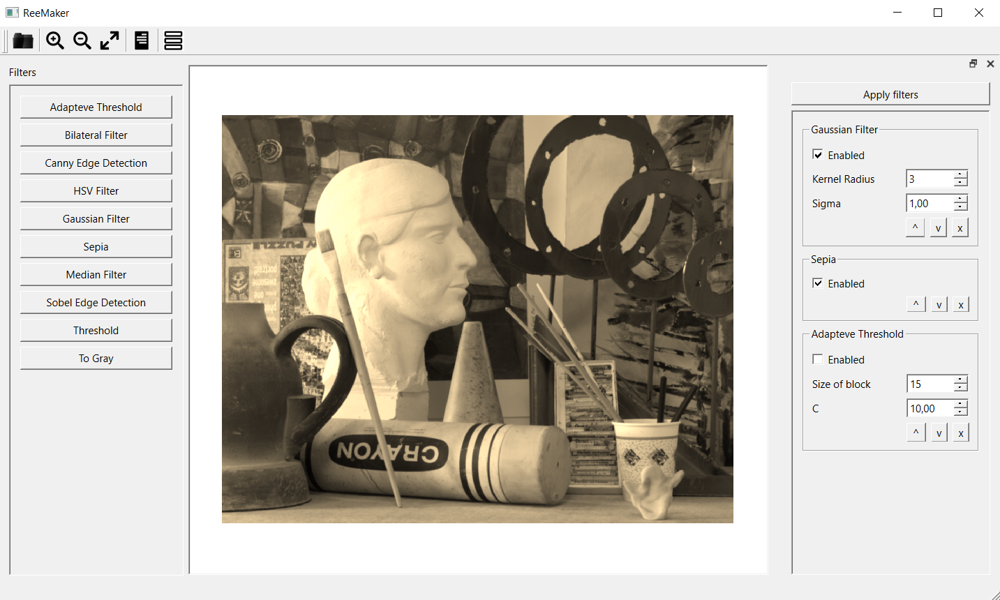

# ReeMaker

ReeMaker is tool for flexible image filtering.

Here are main features of the program:
* Flexible filter ordering;
* Ability to add your own filters. Just put your filter inside .dll file and descride filter parameters in .xml;
* AllMode for processing multiple images at the same time;

## Interface ##

## Example ##

Here is example how watermark was removed from logo. Then logo was stylistically chaged via HSV filter.

